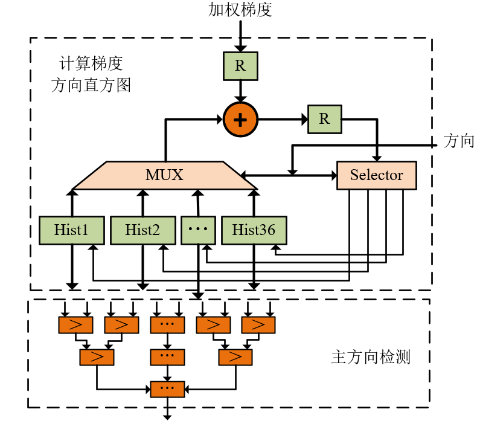
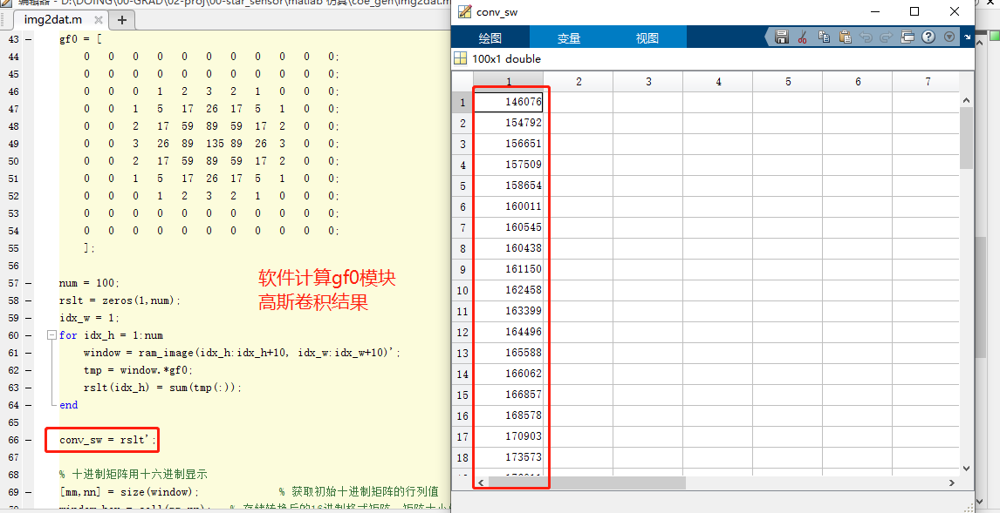

# SIFT算法在FPGA上的硬件实现

### **0. 写在前面**
本设计是基于李晓阳学长在2014年发表的学术成果[**SIFT Hardware Implementation for Real-Time Image Feature Extraction**](https://ieeexplore.ieee.org/document/6727570)，经过实验室导师授权同意，在国产FPGA器件上进行修改并移植的算法验证和实现。本作品获得了“华为杯”第五届中国研究生创芯大赛二等奖以及京微齐力企业专项奖二等奖，在此非常感谢实验室的帮助和学长的成果支持。 

由于成果保护原因，源代码非开源，感兴趣的同学可以联系本人进行交流。


### **1. 原理介绍**
**SIFT**，即尺度不变特征变换（Scale-invariant feature transform，SIFT），是图像处理领域中的一种局部特征描述算法。该算法具有尺度不变性，可在图像中检测出**特征点**，并且利用特征点信息产生128维的特征向量用于描述局部特征。鉴于其优秀的稳定性和抗干扰性，且信息量丰富、产生的特征点数量多，被广泛地运用于**特征提取、图像对准等场景**。   
在实际场合下，SIFT算法计算量大，处理实时性不高的缺点一直制约着它的广泛应用，因此分析算法中耗时过程，并且针对性地使用FPGA进行硬件加速是非常有必要的。本作品设计了一种基于京微齐力P1器件的SIFT算法硬件加速方案，在FPGA上采用了大量并行设计提高处理速度与数据吞吐量，完成了SIFT算法中的```特征点提取```，以及后续生成描述向量所需要的```梯度和方向图像```。


### **2. 模块构成**

<div align=center></div>   

#### **2.1 特征点提取硬件结构**

设计参考了Jie Jiang在2014年提出的SIFT算法硬件实现思路。根据前文所述，特征点定位模块主要分为三个部分：高斯卷积（ST1）、梯度和方向的计算（ST2）、特征点检测（ST3），首先将得到的图像生成窗口，在高斯卷积模块中同时用4个不同尺度的模板进行卷积。尺度1所得到的结果用于计算梯度的幅值和方向。4个尺度的结果两两作差得到高斯差分金字塔，输入至特征点检测模块中运算。ST2、ST3之间是并行的，且ST2、ST3与ST1的数据流向是单向的，因此可以构成任务级的流水线结构。
<div align=center></div>   

#### **2.2 描述向量计算结构**
在Lowe的算法中，每个特征点产生一个128维的描述向量。描述向量模块可以划分成两个子模块，分别是：1）主方向计算模块；2）描述向量生成模块。只有当主方向模块运行完成并输出主方向后才能进行描述向量的计算。因此这两个模块之间采用交互运行的结构，当主方向模块运行完成后，激活描述向量计算模块。当第二个模块运行完成后重新初始化循环，进入下一个特征点描述向量的计算。
<div align=center></div>   

#### **2.3 子模块介绍**

**窗口生成器**  
窗口生成器模块block11x11由10个深度为512的FIFO和11个移位寄存器构成。该模块的功能是从串行输入的图像数据中滑动提取出11x11大小的窗口数据，进行高斯滤波操作。下图展示了3×3窗口生成器的硬件构成，可以看到通过对两行图像数据进行缓存，得到滑动窗口中的9个像素，方便后续操作。
<div align=center></div>   

窗口生成器在Modelsim中的仿真结果

<div align=center></div>    

---

**卷积模块CONV和cov**  

采用了对称预加的方法来减少DSP的消耗数量，即将乘以同一系数的式子合并同类项，先进行加法来减少乘法数量。即由于11×1或是1×11的模板也是对称的，可以先将对称处的图像灰度值先相加再乘以模板系数。
通过上述将11×11的二维卷积**CONV**转化为两个一维模板**cov**，再采用对称预加将每个模板有效系数缩减为6个，最终从121个乘法运算减少到了12个乘法运算。


---

**DoG和local_Extreme模块**  
特征点提取法是在差分高斯金字塔中寻找局部极值点的方法。首先选取比较窗口，比较窗口包含了当前检测点的3×3邻域以及上下两个尺度层的3×3邻域，共27个数据。判断该点是否为特征点的第一个过程为判断该点的值是否是27个数据中的最大值或者最小值。
<div align=center></div>    


---
**主方向计算模块**  
主方向计算模块从功能上可以划分成3个子模块，分别是：1）加权梯度计算；2）构造 16 维的梯度直方图；3）主方向检测。前两个模块采用流水线结构，而主方向检测需要直方图构造完成后才能开始计算，因此主方向检测模块不能采用流水线结构。在主方向检测模块中，采用并行流水线的比较器结构检测直方图中的最大值，因此可以在四个时钟周期后完成计算。该模块输出的数据为主方向，用于直方图重排模块，从为实现描述向量对方向的不变性。主方向计算硬件结构如下图所示
<div align=center></div>   

### **3. 模块仿真**  

**卷积**

在硬件实现中，DoG中例化4个CONV模块，其中gf0实例使用的11×11窗口的高斯权重参数如图所示，示例图像左上角向右滑动的图像窗口卷积结果分别为146076，154792，…，经过比较发现软件和硬件卷积计算的结果是一致的。
<div align=center></div>    

<div align=center></div>    


**特征点提取**  

特征点坐标定位模块DoG的仿真图像如下所示，在3层的高斯差分金字塔中可以构建出一个3×3×3的领域，当领域中心为最大值或者最小值（极值）时，判断其为图像的特征点。如图仿真中kp为极值出现的信号，对应的dina信号则是此时邻域中心在图像上的坐标。
<div align=center></div>   

最后，将特征点坐标表示在原图上  
<div align=center></div>   


